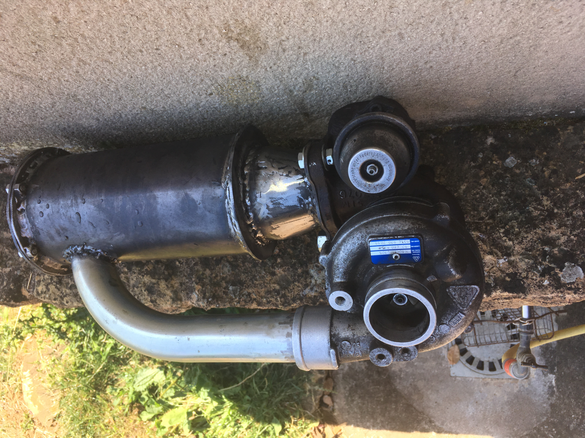

# Introduction

Here you will find the design and development of a DIY turbojet engine.
Feel free to participate and ask me anything about the project.

I started this project even before being trained on many of the topics covered. Through this project I was able to develop my skills on a wide range of engineering. 
[X]Mechanical
[X]Design
[X]Metalworking
[X]Fluid mechanics
[X]Chemistry
[X]Electronics
[X]Programming
[X]Organization
Mechanical, Design, Metalworking, Fluid mechanics, Chemistry, Electronics, programming, Organization.

## Table of Contents
1. [V1](#V1)
  a. [A bit of theory](##A bit of theory)
  b. [Start of the design](##Start of the design)
  c. [How to do it ?](##How to do it ?)
  d. [Start the design](##Start the design)

# V1

The first objective of this project is to produce a functional miniature turbojet engine. That is to say, which is self-sustaining

## A bit of theory

The turbojet transforms the chemical energy of a fuel into kinetic energy. The thrust created by the turbojet comes from the acceleration of a quantity of air between the inlet and the outlet of the system.

To do this, we entered the system with a compressor that allows us to inject a sufficient quantity of air. Then a large amount of energy is released by the combustion of a fuel with the air sent by the compressor. Part of the energy is recovered by a turbine at the system output which will drive the input compressor. The other part of the energy produces the thrust by expansion in the nozzle.

Thanks to the compressor / turbine system, the air flow is self-sustaining. It's our goal. For the moment we are not interested in generating thrust

## How to do it ?

the idea is to use a car turbocharger. Indeed this system integrates a compressor and a turbine on the same axis as desired. The problem is that there is no combustion chamber between the compressor and the turbine. To solve this problem we will deport the combustion chamber.

After recovering a turbocharger from the scrapyard, we can take it apart in order to clean it and keep only what interests us

## Start of the design

Now that we have prepared our turbocharger, we need to create a combustion chamber between the compressor and the turbine.
We will rely on documentation found on the internet:

Note that the combustion chamber is made up of a casing through which passes a flame tube. This one is pierced, which allows the correct mixing of air and fuel.

Although we understand how it works, we need to know a minimum of the proportions to respect to size the combustion chamber in relation to our turbocharger. To do this, we redo [this](https://www.youtube.com/watch?v=6GywwbhqR_o&ab_channel=colinfurze) video of the youtuber Colinfurze.

We measure the diameter of the inlet of the compressor $R = 1.75$
We calculate the air inlet surface of the compressor $S = piR^2$

