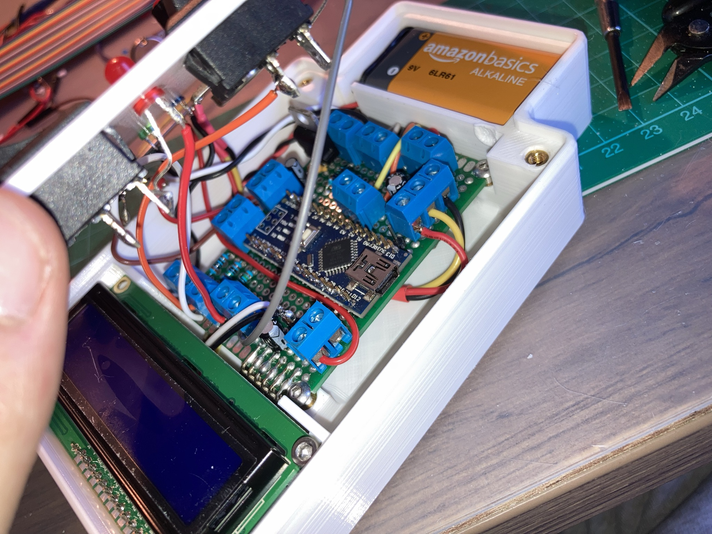

# Introduction

Here you will find the design and development of a DIY ```**turbojet engine.**```
Feel free to participate and ask me anything about the project.

```**Demo video :**```

[](https://youtu.be/5YPhWXnR1MU)

I started this project even before being trained on many of the topics covered. Through this project I was able to develop my skills on a wide range of engineering.
```- Mechanical```
```- Design```
- Metalworking 
- Fluid mechanics
- Chemistry
- Electronics
- Programming
- Organization.

## Table of Contents
- [V1](#V1)
  - [A bit of theory](#theory)
  - [How to do it ?](#how)
  - [Start the design](#design)
  - [Industrial design](#drawing)
  - [Manufacturing](#Manufacturing)
  - [How to run it ?](#run)
  - [Test](#Test)
- [V2](#V2)
  - [Spark](#Spark)
  - [Air](#Air)
  - [Gaz](#Gaz)
  - [Communication](#Communication)
  - [Test bench](#bench)

# V1

The first objective of this project is to produce a functional miniature turbojet engine. That is to say, which is self-sustaining

## A bit of theory <a name="theory"></a>


The turbojet transforms the chemical energy of a fuel into kinetic energy. The thrust created by the turbojet comes from the acceleration of a quantity of air between the inlet and the outlet of the system.

To do this, we entered the system with a compressor that allows us to inject a sufficient quantity of air. Then a large amount of energy is released by the combustion of a fuel with the air sent by the compressor. Part of the energy is recovered by a turbine at the system output which will drive the input compressor. The other part of the energy produces the thrust by expansion in the nozzle.

Thanks to the compressor / turbine system, the air flow is self-sustaining. It's our goal. For the moment we are not interested in generating thrust

## How to do it ? <a name="how"></a>

the idea is to use a car turbocharger. Indeed this system integrates a compressor and a turbine on the same axis as desired. The problem is that there is no combustion chamber between the compressor and the turbine. To solve this problem we will deport the combustion chamber.

After recovering a turbocharger from the scrapyard, we can take it apart in order to clean it and keep only what interests us


## Start of the design <a name="design"></a>

Now that we have prepared our turbocharger, we need to create a combustion chamber between the compressor and the turbine.
We will rely on documentation found on the internet:


Note that the combustion chamber is made up of a casing through which passes a flame tube. This one is pierced, which allows the correct mixing of air and fuel. There are 3 zones in the combustion chamber. from combustion to ejection we have: 
1. Primary zone
2. Secondary zone
3. Dilution zone

Although we understand how it works, we need to know a minimum of the proportions to respect to size the combustion chamber in relation to our turbocharger. To do this, we redo [this](https://www.youtube.com/watch?v=6GywwbhqR_o&ab_channel=colinfurze) video of the youtuber Colinfurze.


We measure the diameter $D =  2R$ of the inlet of the compressor $$R = 1.75 cm$$

We calculate the air inlet surface of the compressor $$S = \pi R^2 = 9.62 cm^3$$

The surface of the air inlet of the primary zone must be 30% of the surface of the surface of the air inlet of the compressor, therefore:
$$S_{1} = \frac{30}{100}\ S = 2.89 cm^2$$

This surface is divided into 2 rows of 13 holes around the flame tube. So each hole must have an area of:

$$S_{a} = \frac{S_{1}}{26}\ = 0.11 cm^3$$

So a diameter $D_{1} = 0.37 cm = 3.7mm$

We do the same for the secondary zone which must have an air inlet of 20% of that of the compressor inlet.

$$S_{2} = \frac{20}{100}\ S = 1.92 cm^2$$

This surface is divided into 5 holes: $$S_{b} = \frac{S_{2}}{5}\ = 0.38 cm^3$$

So holes with a diameter $D_{2} = 0.70 cm = 7.0 mm$

We do the same for the dilution zone which must have an air inlet of 50% of that of the compressor inlet.

$$S_{3} = \frac{50}{100}\ S = 4.81 cm^2$$

This surface is divided into 5 holes: $$S_{c} = \frac{S_{3}}{5}\ = 0.96 cm^3$$

So holes with a diameter $D_{3} = 1.11 cm = 11.1 mm$

After which the length and diameters of the tubes are dimensioned according to the following rules:

Flame tube length $L = 6D = 210mm$

Flame tube diameter $D_{f} = 2D = 70 mm$

Casing tube diameter $D_{casing} = D_{f} + 30 = 100 mm$

At the metal merchant we choose 3mm thick steel tubes. It may be a little oversized but it will save us some trouble.

The dimensions that come closest to our theoretical dimensions are a tube of 80 mm in diameter for the flame tube and 108 mm for the casing.

## Industrial design <a name="drawing"></a>

Now that we have the dimensions, we can move on to the drawing part to have plans that we will use later.


We take advantage of this to provide a cooling system for the gas circuit.


## Manufacturing

here photos of the manufacture and implementation of the combustion chamber on the turbocharger:


## How to run it ? <a name="run"></a>

To start the turbo, you must start by turning the compressor enough to bring air into the combustion chamber. At the same time we must inject the right amount of fuel (we use butane because the latter being fragrant it allows us to realize if there is a leak) and for the mixture to ignite, we must trigger a spark.

To make the compressor run, a blower from another compressor is used (max pressure 10 bars).

To manage the quantity of gas injected, a quarter-turn valve is used.

To create a spark, we use a car candle, lit by a small device that can be found cheap on amazon and whose energy comes from a conventional battery. The electrodes of the spark plug are well spaced in order to create the largest possible spark.


These 3 devices are grouped together on a control table near the turbojet

## Test

### Test 1

We make a soft start, that is to say that we send very little air and very little gas just to start combustion. Combustion starts but the turbine does not recover any power and does not allow the compressor to run to self-maintain the air flow

### Test 2

I sent as much air as possible with the blower on the compressor to give it enough energy to start. I slowly open the throttle valve while activating the spark. When the air / fuel ratio is good, the turbojet starts, it is self-sustaining. The goal is reached.

What is unfortunate is that we do not feel any power. While my valve is fully open.

**Demo video :**

[](https://youtu.be/5YPhWXnR1MU)

### Test 3

The purpose of this test is to get more power. To do this, we need to increase the amount of fuel entering the combustion chamber. Since I'm already fully on the throttle valve, I can only play with the diameter of my injector. The problem is that as soon as I increase this size, the regulator on my gas bottle goes into safety.

# V2

The objective of the V2 is to increase the power of the turbojet engine. We can then add a nozzle to create thrust.

To do this I bought a new regulator, which allows a much higher flow and pressure than the previous one.

The problem is that now I can't find the right mixtures by hand. I think there is too much fuel compared to the air. Moreover, by considerably increasing the amount of fuel that can be injected, we have increased the danger of handling. If the pressure suddenly increases, the combustion chamber could explode.

**Demo video :**

[](https://youtu.be/BzaCEIvwCl0)

The idea of the V2 is therefore to make the turbojet remotely controllable with the use of the new regulator.

We therefore have 3 things to control:
- The spark
- The air
- The gas flow

## Spark

The spark is triggered by an electrical contact (by pressing a button). You can easily close the electrical contact with a relay.

## Air

At first I wanted to be able to manage the airflow. So I used a servomotor to more or less control the opening of the blower. It worked but I had some reliability issues.

**Demo video :**

[](https://youtu.be/y2Q_39y3OnU)

Finally we saw during our previous test that to start the turbojet we had to send as much air as possible into the compressor. So we can use a solenoid valve to on/off control the air supply

## Gaz

The gas part is more complex. Because it is necessary that we can precisely manage the flow of gas.

There are proportional solenoid valves but they are quite expensive. Instead we are going to use our manual quarter-turn valve that we were already using but we are going to couple it to a motorization to manage its opening. We take this opportunity to add a solenoid valve upstream in order to have the possibility of instantly cutting off the gases.

How to motorize the valve?

The idea is to create an electric actuator that pushes or pulls on the valve to manage its opening.

In a first attempt I used a DC motor with a screw nut system and a potentiometer installed on the axis of rotation of the valve. This first attempt was functional but not reliable and precise enough. Indeed, I had trouble aligning the axis of the screw with that of the motor, which induced a lot of vibration. Moreover, I did not succeed in controlling the opening angle of the valve according to the command requested.

**Demo video :**

[](https://youtu.be/Buvl3nQfvQg)


The current system is visually quite similar but is quite different. The DC motor is replaced by a stepper motor. This change means that we no longer need to control the position of the valve with the command. Indeed, we can link the opening angle of the valve to the number of steps taken by the motor provided we know the initial opening angle of the valve. Currently I manually put the valve in the closed position at initialization but eventually I will develop an automatic initialization.

In addition, I replaced the classic screw and nut with a screw-nut system with several threads, as can be found on a 3D printer. It is more suitable because you can pass a lot more torque by turning the screw less quickly.

**Demo video :**

[](https://youtu.be/UdKoBPVw2Po)
[](https://youtu.be/P5eirryI0JA)

## Communication

Now that we know how to control the spark, the air and the gas, we must choose a technology for remote control.

The first idea was to create a remote control that communicates via bluetooth. The remote control has been made. based on an arduino nano and an hc-05 bluetooth module.

**codes [here](Bluetooth_communication/)**




**Demo video :**

[](https://youtu.be/LgDKdboIwjw)

After some tests, I noticed that there could be data loss problems in the communication, disconnection problems. In short, this technology was not reliable enough. And we don't want to lose control during the manipulation. So I looked for another technology.

The new and last idea is to use Wifi. We use an ESP32 in access point mode. We host a web page on it. To control the turbojet, you connect to the ESP32's wifi (in optimal conditions you can reach a range of 100m) and you load the web page on which you can interact with buttons. After a few tests I did not notice any problem on the contrary, it works very well.

I thank Tommy desrochers who thanks to these [tutorials](https://tommydesrochers.com/premiers-tests-pour-bien-debuter-avec-lesp32-ep1/) allowed me to take control of the ESP32.

code here

**Demo video :**

## Test bench <a name="bench"></a>

Now that we have everything to control the turbojet, it's time to put everything together on a test bench to start our tests. On this test bench we will find the valve control system, the spark control system, the gas control system, a custom PCB (see here) for our ESP32, a purchased relay PCB, a 12V power supply. We also order traffic lights that operate at 230V in order to have a visual indicator when we are away from the turbojet.

**[Here](SolidWorks/) the SolidWorks files**


**[Here](Gerber_PCB_TurboV2.zip) the Gerber files for the PCB.** Note that the 3.3v -> 5V shifter output is useless

Finally we get this:


