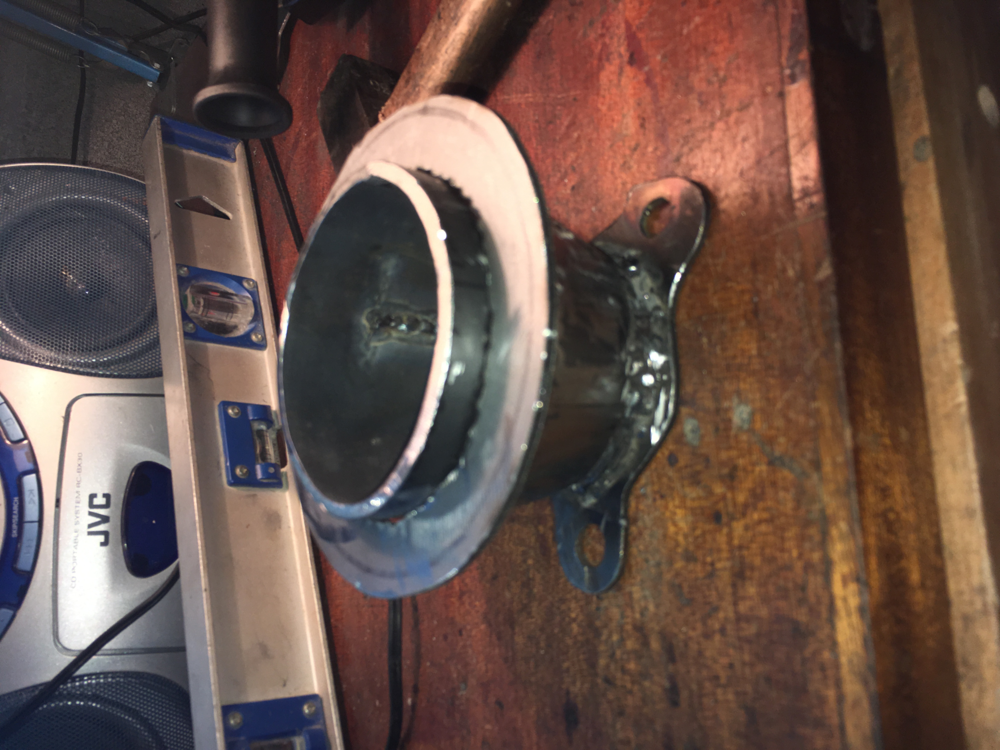

# Introduction

Here you will find the design and development of a DIY turbojet engine.
Feel free to participate and ask me anything about the project.

I started this project even before being trained on many of the topics covered. Through this project I was able to develop my skills on a wide range of engineering.
Mechanical, Design, Metalworking, Fluid mechanics, Chemistry, Electronics, Programming, Organization.

## Table of Contents
- [V1](#V1)
  - [A bit of theory](#theory)
  - [How to do it ?](#how)
  - [Start the design](#design)
  - [Industrial design](#drawing)
  - [Manufacturing](#Manufacturing)

# V1

The first objective of this project is to produce a functional miniature turbojet engine. That is to say, which is self-sustaining

## A bit of theory 

The turbojet transforms the chemical energy of a fuel into kinetic energy. The thrust created by the turbojet comes from the acceleration of a quantity of air between the inlet and the outlet of the system.

To do this, we entered the system with a compressor that allows us to inject a sufficient quantity of air. Then a large amount of energy is released by the combustion of a fuel with the air sent by the compressor. Part of the energy is recovered by a turbine at the system output which will drive the input compressor. The other part of the energy produces the thrust by expansion in the nozzle.

Thanks to the compressor / turbine system, the air flow is self-sustaining. It's our goal. For the moment we are not interested in generating thrust

## How to do it ? 

the idea is to use a car turbocharger. Indeed this system integrates a compressor and a turbine on the same axis as desired. The problem is that there is no combustion chamber between the compressor and the turbine. To solve this problem we will deport the combustion chamber.

After recovering a turbocharger from the scrapyard, we can take it apart in order to clean it and keep only what interests us

## Start of the design 

Now that we have prepared our turbocharger, we need to create a combustion chamber between the compressor and the turbine.
We will rely on documentation found on the internet:

Note that the combustion chamber is made up of a casing through which passes a flame tube. This one is pierced, which allows the correct mixing of air and fuel. There are 3 zones in the combustion chamber. from combustion to ejection we have: 
1. Primary zone
2. Secondary zone
3. Dilution zone

Although we understand how it works, we need to know a minimum of the proportions to respect to size the combustion chamber in relation to our turbocharger. To do this, we redo [this](https://www.youtube.com/watch?v=6GywwbhqR_o&ab_channel=colinfurze) video of the youtuber Colinfurze.

We measure the diameter $D =  2R$ of the inlet of the compressor $$R = 1.75 cm$$

We calculate the air inlet surface of the compressor $$S = \pi R^2 = 9.62 cm^3$$

The surface of the air inlet of the primary zone must be 30% of the surface of the surface of the air inlet of the compressor, therefore:
$$S_{1} = \frac{30}{100}\ S = 2.89 cm^2$$

This surface is divided into 2 rows of 13 holes around the flame tube. So each hole must have an area of:

$$S_{a} = \frac{S_{1}}{26}\ = 0.11 cm^3$$

So a diameter $D_{1} = 0.37 cm = 3.7mm$

We do the same for the secondary zone which must have an air inlet of 20% of that of the compressor inlet.

$$S_{2} = \frac{20}{100}\ S = 1.92 cm^2$$

This surface is divided into 5 holes: $$S_{b} = \frac{S_{2}}{5}\ = 0.38 cm^3$$

So holes with a diameter $D_{2} = 0.70 cm = 7.0 mm$

We do the same for the dilution zone which must have an air inlet of 50% of that of the compressor inlet.

$$S_{3} = \frac{50}{100}\ S = 4.81 cm^2$$

This surface is divided into 5 holes: $$S_{c} = \frac{S_{3}}{5}\ = 0.96 cm^3$$

So holes with a diameter $D_{3} = 1.11 cm = 11.1 mm$

After which the length and diameters of the tubes are dimensioned according to the following rules:

Flame tube length $L = 6D = 210mm$

Flame tube diameter $D_{f} = 2D = 70 mm$

Casing tube diameter $D_{casing} = D_{f} + 30 = 100 mm$

At the metal merchant we choose 3mm thick steel tubes. It may be a little oversized but it will save us some trouble.

The dimensions that come closest to our theoretical dimensions are a tube of 80 mm in diameter for the flame tube and 108 mm for the casing.

## Industrial design 

Now that we have the dimensions, we can move on to the drawing part to have plans that we will use later.

We take advantage of this to provide a cooling system for the gas circuit.

## Manufacturnig

here photos of the manufacture and implementation of the combustion chamber on the turbocharger:

